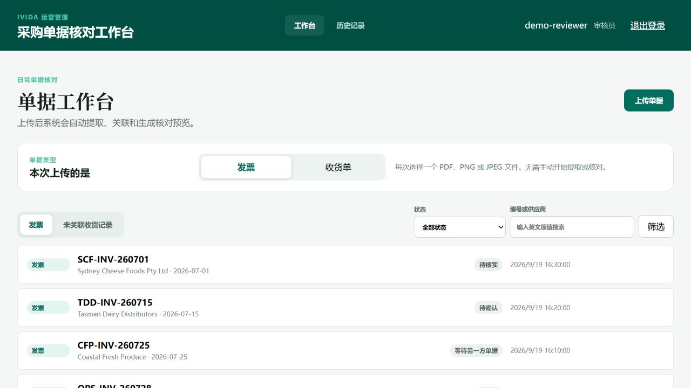
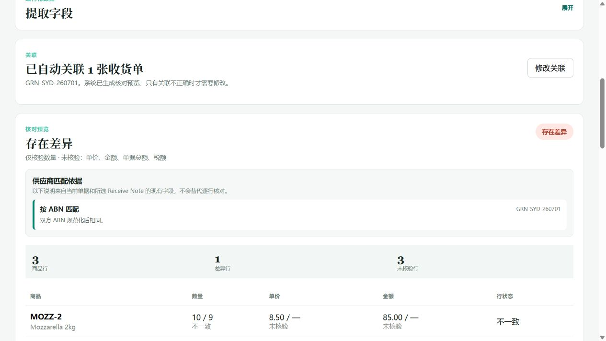
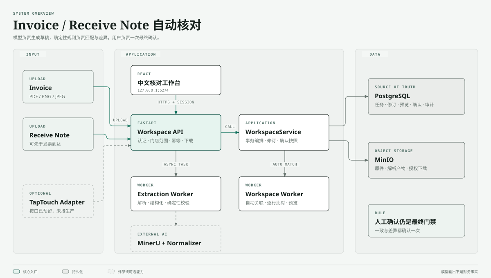

# IVIDA Invoice Reconciliation

[](https://github.com/EdmendZ/IVIDAInvoiceReconciliation/actions/workflows/ci.yml)
[](https://github.com/EdmendZ/IVIDAInvoiceReconciliation/actions/workflows/codeql.yml)

面向澳洲餐饮门店的 Invoice / Receive Note 自动核对工作台。单据可以任意顺序到达；
系统自动提取、关联并生成逐行差异，用户查看原件后只确认一次。界面使用中文，供应商、
商品、编号和金额等业务原值保持英文。

> 当前为本地 Pilot。TapTouch 适配接口已经预留，但尚未连接真实生产 API；系统不包含
> 合同、完整采购订单、付款、总账或库存主数据模块。

## 产品界面





截图来自当前 React 前端和项目内的确定性 demo fixture，用于展示界面与业务状态；它们
不代表已经导入生产数据，也不用于证明 MinerU、模型或 TapTouch 的真实准确率。

## 核心流程

1. 用户上传 Invoice 或 Receive Note；另一侧可以稍后到达。
2. Extraction Worker 异步解析原件并生成可审核修订，用户无需点击“开始提取”。
3. Workspace Worker 在同一门店范围内自动寻找候选；一张 Invoice 可以关联多张完整
   Receive Notes。
4. 用户在同一详情页查看双方原件、英文业务字段、匹配依据和逐行结果。
5. 一致结果和差异结果都只确认一次；真正差异需要处理说明，缺少可比数据则显示“未核验”。
6. 确认结果保存为不可变快照；后续更正通过重开形成新修订，旧记录不会被覆盖。

重复文件通过 SHA-256 复用原记录；同店同编号发票在确认前阻断。一张收货单进入正式
结果后不能同时用于另一张发票。候选分数只用于排序和解释，不表示概率，也不替代人工确认。

## 系统架构



关键设计边界：

- **确定性规则拥有最终判断权**：模型只生成结构化草稿，匹配、容差和差异由领域规则计算。
- **PostgreSQL 是事实源**：任务、修订、预览、确认和追加式审计均持久化，不依赖进程内状态。
- **MinIO 保存原件**：浏览器通过受授权接口读取文件，不接触对象存储地址或凭据。
- **Worker 可恢复**：数据库租约、fencing、幂等键和事务锁避免重复提交及过期进程覆盖结果。
- **权限按门店收窄**：HttpOnly Session、CSRF/Origin 校验和 tenant/store 范围共同保护数据。

模块职责、写入边界和历史快照设计见 [架构说明](docs/architecture.md)。

## 技术栈

| 层 | 实现 |
|---|---|
| 前端 | React 19、TypeScript、Vite、TanStack Query |
| API | FastAPI、Pydantic、HttpOnly Session |
| 后台任务 | Extraction Worker、Workspace Worker、数据库租约 |
| 数据 | PostgreSQL、SQLAlchemy、Alembic、MinIO |
| 文档抽取 | MinerU + OpenAI-compatible Normalizer，可关闭 |
| 验证 | Pytest、Vitest、Ruff、GitHub Actions |

## 本地启动

需要 Python 3.11 或 3.12、`uv`、Node.js 22、可访问的 PostgreSQL 和 MinIO。
Docker Compose 只是可选的交付演示，不是日常开发前置条件。

```powershell
git clone https://github.com/EdmendZ/IVIDAInvoiceReconciliation.git
cd IVIDAInvoiceReconciliation
Copy-Item .env.example .env
uv sync
npm --prefix frontend ci
uv run python init_database.py
```

编辑 `.env`，至少填写独立的 PostgreSQL database 和 MinIO bucket。启用简化工作台时还要设置：

```dotenv
APP_ENV=dev
WORKSPACE_ENABLED=true
WORKSPACE_TENANT_ID=demo-tenant
WORKSPACE_STORE_ID=demo-store
```

创建或重置开发管理员：

```powershell
uv run python setup_dev_admin.py
```

脚本会输出 `adminuser` 的一次性临时密码，并注销该账号的旧 Session；不要把密码写入
README、日志或 Git。随后启动完整本地链路：

```powershell
.\start_local_demo.ps1
```

启动器运行 API、两个 Worker 和前端，验证 `8200`、`5274` 端口后打开工作台。停止时运行：

```powershell
.\stop_local_demo.ps1
```

常用入口：

- 工作台：<http://127.0.0.1:5274>
- API 文档：<http://127.0.0.1:8200/docs>
- 健康检查：<http://127.0.0.1:8200/api/health>
- Extraction Quality Lab：<http://127.0.0.1:5274/lab>

`/api/health` 只说明 API 进程在线。数据库、MinIO 和 Worker 状态仍应在工作台或
`/api/runtime/status` 中单独检查。

## 演示与评测数据

创建六份固定英文 PDF 和四类工作台状态：

```powershell
uv run python setup_demo_data.py
```

如果本机已经有被 Git 忽略的 `evaluation_data/`，可将 8 个案例、17 份 PDF 导入网页：

```powershell
uv run python tools/validate_evaluation_dataset.py
uv run python setup_evaluation_data.py
```

两个入口都使用明确标记的 fixture Draft，以便稳定演示现有匹配和核对规则。它们绕过
真实 OCR 和结构化模型，不能作为抽取准确率证据。真实模型比较方法见
[AI 抽取与评测](docs/ai.md)。

真实模型实验只通过 `app.cli.create_experiment` 和 `app.cli.run_experiment` 创建及执行；
`/lab` 读取已保存结果。评测建议和 Promotion Decision 不会自动修改生产模型配置。

## 验证

```powershell
uv run pytest -q
uv run ruff check .
npm --prefix frontend test -- --run
npm --prefix frontend run build
uv run python tools/check_spec_contract.py --spec-root spec
uv run python tools/check_documentation_sync.py
```

需要 PostgreSQL 的工作台集成测试只接受名称以 `_workspace_test` 结尾的隔离数据库；
缺少外部服务时只跳过对应集成验证，不会把跳过描述成通过。

## 仓库结构

```text
app/api/          HTTP、认证、权限范围和错误映射
app/services/     用例编排与事务边界
app/domain/       状态、DTO、匹配和逐行核对规则
app/infra/        PostgreSQL、MinIO、MinerU、模型适配器
app/workers/      抽取与工作台后台任务
frontend/src/     中文 React 工作台
migrations/       数据库结构唯一演进记录
spec/             冻结接口、状态机、规则和任务边界
docs/             少量长期维护文档与图片资产
```

## 文档入口

| 文档 | 适合回答的问题 |
|---|---|
| [产品与流程](docs/product.md) | 业务解决什么问题，为什么这样操作？ |
| [架构](docs/architecture.md) | 模块如何交互，数据和安全边界在哪里？ |
| [AI 抽取与评测](docs/ai.md) | MinerU、模型、证据和指标如何工作？ |
| [开发与运行](docs/development.md) | 如何配置、启动、测试、排障和交付？ |
| [演示与源码导读](docs/demo.md) | 如何演示，以及先读哪些源码？ |
| [冻结 Spec](spec/README.md) | 当前接口、状态机和任务文件范围是什么？ |

权威顺序为 **冻结 Spec → 代码与迁移 → 主题文档**。贡献前阅读
[CONTRIBUTING.md](CONTRIBUTING.md)，业务或接口变化必须同步最相关的文档。
