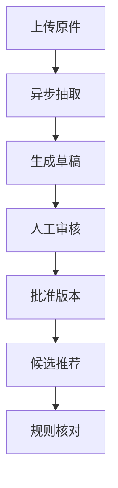

# IVIDA Invoice Reconciliation 文档中心

这组文档用于三件事：

1. 帮助第一次接触项目的人理解业务，而不是只看见 API 和数据库表；
2. 帮助开发者沿着一张单据的生命周期定位代码；
3. 帮助面试时用清晰、诚实、可验证的方式介绍项目。

项目定位是 **AI 辅助财务单据审核 Pilot**。MinerU 和大模型负责从非结构化
文件中提取候选数据；Pydantic、确定性规则和人工审核负责约束结果。系统不会
让大模型直接批准付款。

## 推荐阅读顺序

| 顺序 | 文档 | 解决的问题 |
|---:|---|---|
| 1 | [业务全景](business/01-business-overview.md) | 为什么需要 Invoice 与 Receive Note 核对？ |
| 2 | [架构与代码地图](architecture/02-architecture-and-code-map.md) | 每一层负责什么，代码从哪里开始看？ |
| 3 | [单据生命周期](business/03-document-lifecycle.md) | Task、Run、Draft、Version 为什么不能合并？ |
| 4 | [AI 抽取链路](ai/04-extraction-pipeline.md) | MinerU、LLM、Schema、Evidence 如何协作？ |
| 5 | [人工审核与版本治理](business/05-review-and-versioning.md) | 为什么编辑要创建新版本？批准发生在哪里？ |
| 6 | [候选匹配与一对多核对](business/06-reconciliation-rules.md) | 如何判断哪些 Receive Notes 属于同一张 Invoice？ |
| 7 | [数据与基础设施](architecture/07-data-and-infrastructure.md) | PostgreSQL、MinIO、Worker 分别保存什么？ |
| 8 | [API、前端与本机运行](operations/08-api-ui-and-local-run.md) | 如何启动、访问和演示完整流程？ |
| 9 | [测试与模型评测](ai/09-testing-and-evaluation.md) | 如何证明业务规则和模型效果不是“看起来能跑”？ |
| 10 | [面试复习手册](interview/10-interview-handbook.md) | 面试官可能追问什么，应该如何回答？ |

源码级参考：

- [API 契约参考](reference/11-api-contracts.md)
- [PostgreSQL 数据字典](reference/12-database-dictionary.md)
- [错误码与分层排障](operations/13-error-codes-and-troubleshooting.md)
- [源码调用链导读](architecture/14-source-code-walkthrough.md)

已有的专题材料：

- [五分钟演示脚本](interview/demo-script.md)
- [项目故事](interview/project-story.md)
- [模型选择记录](interview/model-selection.md)
- [评测数据集](evaluation-dataset.md)
- [审核操作流程](operations/review-workflow.md)
- [PostgreSQL 初始化](postgresql-setup.md)

## 一条主线看懂项目

对应代码入口：

| 阶段 | 主要入口 |
|---|---|
| 上传原件 | `app/services/document_upload_service.py` |
| 创建抽取任务 | `app/services/extraction_service.py` |
| Worker 执行 | `app/workers/extraction_worker.py` |
| 人工审核 | `app/services/review_service.py` |
| 候选推荐 | `app/services/candidate_matching_service.py` |
| 确定性核对 | `app/services/reconciliation_service.py` |
| 已批准版本门禁 | `app/services/reconciliation_application_service.py` |

## 文档同步规则

修改代码前先查看 [文档维护规范](documentation-policy.md)。凡是改变以下内容，
必须在同一个提交中更新对应文档：

- 业务规则或状态转换；
- API 请求、响应或权限；
- 数据模型、数据库表或迁移；
- Prompt、模型 Provider 或评测指标；
- 本机启动、部署、环境变量或故障恢复；
- 前端业务文案和用户操作流程。

仓库提供 `tools/check_documentation_sync.py`，用于检查关键代码变更是否同时
包含对应文档变更。
