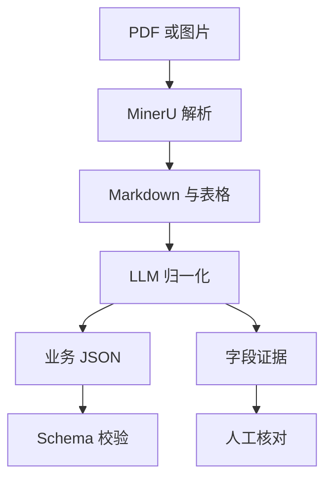

# AI 抽取链路：MinerU、LLM、Schema 与 Evidence

## 核心思路

项目没有直接把原始 PDF 扔给一个视觉模型并接受最终答案，而是拆成两阶段：



这让 OCR/版面错误与语义映射错误可以分别定位，也让不同 LLM 实验复用同一份
MinerU 结果。

## 第一阶段：MinerU 解析

实现位置：`app/infra/mineru_parser.py`

输入：

- 文件名；
- MIME 类型；
- 原件 bytes。

输出：

- Markdown；
- content blocks；
- tables；
- page count；
- 远端任务 ID；
- ZIP 解析产物。

Worker 不会阻塞等待一个长 HTTP 请求，而是：

1. `submit()` 获取远端 Job ID；
2. 将 Job ID 和下次轮询时间写入 PostgreSQL；
3. 释放 Worker 租约；
4. 到期后 `poll()`；
5. 成功后将 ZIP 写入 MinIO，将结构化解析结果写入 PostgreSQL。

## 第二阶段：LLM 归一化

实现位置：`app/infra/openai_normalization_provider.py`

LLM 输入包含：

- 目标类型：Invoice 或 Receive Note；
- 对应 Pydantic JSON Schema；
- MinerU Markdown；
- MinerU content blocks；
- 系统 Prompt 和用户 Prompt 模板。

输出必须具有两个顶层字段：

```json
{
  "document": {},
  "evidence": []
}
```

`document` 会再次通过 `Invoice` 或 `ReceiveNote` 的 Pydantic 校验。即使模型
返回合法 JSON，只要缺少必填字段、数值不合法或单据类型错误，仍会失败。

## Evidence 是什么

Evidence 把结构化字段指向原文依据，例如：

```text
field_path: document.items[0].quantity
source_text: "Pizza flour 12.5 kg | Qty 8 | 22.50"
page: 1
```

它服务于两个目标：

1. 审核人员能快速判断模型值是否来自原件；
2. 评测器能计算 Gold 字段中有多少拥有证据。

Evidence 并不证明字段一定正确，只证明模型声明了来源。正确性仍由 Gold
评测或人工判断。

## 为什么关闭思考模式

结构化字段映射更接近受约束的信息抽取，不需要长推理链。默认关闭思考模式，
主要为了降低：

- 延迟；
- 输出 Token；
- JSON 前后混入解释文字的风险。

这不是永久结论。候选模型必须在同一评测集上比较准确率、Schema 失败率、
证据覆盖率、延迟和成本。

## 为什么不限制输出 Token

Invoice 行项目可能很多。人为设置过小的输出上限会在 JSON 中间截断，导致
整个文档无法解析。当前默认不传最大输出限制，由模型自身上下文限制管理。

如果特定供应商必须限制输出，应同时：

- 监控截断结束原因；
- 将 Schema 失败计入评测；
- 评估按页或按表格分块；
- 不把截断响应静默修补成“成功”。

## Prompt 版本如何追踪

`app/services/prompt_version.py` 对系统 Prompt 和用户模板计算稳定 SHA-256
指纹。Run 保存：

- parser provider/model；
- normalizer provider/model；
- prompt version；
- input/output tokens；
- normalization latency；
- estimated cost。

这样同一个结果可以回答“由哪个模型、哪个 Prompt 产生”。

## 错误与重试

外部错误被包装为 `ExternalServiceError`：

- `code`：稳定错误类型；
- `safe_message`：可以展示但不泄露凭据；
- `retryable`：是否适合重试。

Worker 对可重试错误最多进行有限次数的指数退避。SDK 隐式重试被关闭，避免
出现“数据库显示一次调用，SDK 实际偷偷调用多次”的审计盲区。

## 为什么暂时不直接使用公共视觉模型

公共视觉模型可以作为对照组，但默认两阶段链路具备几个工程优势：

| 维度 | MinerU + 文本 LLM | 端到端视觉 LLM |
|---|---|---|
| 错误定位 | 可区分解析与归一化 | 错误集中在一次黑盒调用 |
| Prompt/模型实验 | 复用解析缓存 | 通常重新发送图片 |
| 证据 | 可引用 Markdown/Block | 取决于模型坐标能力 |
| 成本结构 | 解析与归一化独立计算 | 单次多模态计费 |
| 替换组件 | Parser 和 Normalizer 可独立换 | 通常整体替换 |

是否替换不能靠印象，应在同一 Gold 数据集上比较。

## 代码阅读顺序

1. `app/domain/parsing.py`：Parser Contract；
2. `app/domain/normalization.py`：Normalizer Contract 和 Evidence；
3. `app/infra/mineru_parser.py`：远端解析适配；
4. `app/infra/openai_normalization_provider.py`：JSON 归一化；
5. `app/workers/extraction_worker.py`：两阶段编排；
6. `app/evaluation`：离线评测。

## 面试复习点

- 两阶段链路的价值是可诊断、可缓存、可替换；
- Schema 校验与 JSON Mode 不是一回事；
- Evidence 支持人工审核，但不等于正确性证明；
- 隐式重试会破坏调用次数和成本审计；
- 模型选择应由评测数据决定，而不是只看榜单。
