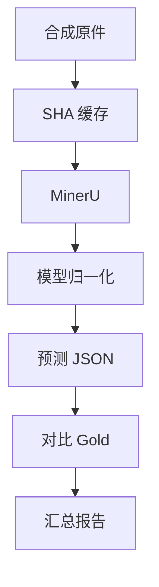

# 测试与模型评测：如何证明系统不是“看起来能跑”

## 两类正确性

项目需要分别验证：

1. **软件正确性**：状态机、规则、权限、版本和 API 是否按设计工作；
2. **模型效果**：抽取字段、商品行和证据是否准确。

单元测试通过不能证明模型准确；模型样例表现好也不能证明状态机安全。

## 后端测试

运行：

```powershell
.\.venv\Scripts\python.exe -m pytest
```

主要覆盖：

| 测试组 | 验证内容 |
|---|---|
| upload | 文件签名、大小、对象回滚 |
| extraction | Run 状态、取消、Worker 阶段 |
| validation | 行金额、税额、小计和总额 |
| review | 版本、新旧版本冲突、批准门禁 |
| candidate | 候选权重和关键冲突 |
| reconciliation | 聚合、容差和一对多结果 |
| route governance | 未认证请求不能访问业务数据 |
| evaluation | 缓存、指标、失败隔离和排名 |

## 前端测试

```powershell
Set-Location frontend
npm test -- --run
npm run build
```

当前重点测试纯展示逻辑，例如：

- Worker offline 时 queued 应显示“等待处理服务启动”；
- 未配置模型价格不能显示为 AUD 0；
- 延迟和 Token 缺失要诚实呈现。

复杂页面交互测试仍可继续补充，这是当前 Pilot 的测试边界。

## 合成评测数据

`evaluation_data/` 被 Git 忽略，包含 8 个澳洲披萨采购场景、17 份 PDF：

- 完全一致；
- 分批收货；
- 短收；
- 单价不一致；
- 发票独有商品；
- 收货单独有商品；
- GST/价格容差；
- 采购订单号不一致。

所有公司、ABN、价格和交易为虚构。

## 为什么需要 Gold

Gold JSON 是人工确定的期望结构。没有 Gold，只能展示模型输出，无法计算：

- 字段准确率；
- 行项目召回/精确关系；
- Evidence 覆盖率；
- Schema 失败率。

Gold 还必须得到原件支持。当前合成数据生成器会显式打印供应商名称和商品行号，
校验器会检查关键 Gold 值能否在 PDF 文本中定位。否则，一个遵守“不得推断”的
模型可能因为正确返回 `null` 而被错误扣分。

PDF 中存在但 MinerU Markdown 中缺失的字段属于 Parser 信息损失；MinerU 已保留
但结构化模型抽取错误的字段才适合用于 Prompt A/B 实验。端到端指标仍应记录两类
失败，但错误分析必须区分责任阶段。

## 评测流程



第一次运行 MinerU，随后更换 Prompt/LLM 会复用解析缓存。

## 指标解释

### Schema Valid Rate

能被目标 Pydantic Schema 接受的文档比例。它只说明格式和基本约束合法，不
说明字段值正确。

### Field Micro Accuracy

在全部文档、全部 Gold 字段上累计正确数：

$$
Accuracy_{micro} = \frac{\sum correct\ fields}{\sum gold\ fields}
$$

| 符号 | 含义 |
|---|---|
| correct fields | 与 Gold 等价的字段数 |
| gold fields | 评测集中所有期望字段数 |

Decimal 值按数值比较，文本进行空白和大小写标准化。

### Line-item F1

商品行优先按 SKU 匹配，缺少 SKU 时按描述匹配。缺失行与幻觉行分别计数：

$$
F1 = \frac{2M}{2M + Missing + Extra}
$$

| 符号 | 含义 |
|---|---|
| $M$ | 成功配对的商品行 |
| $Missing$ | Gold 有、预测没有 |
| $Extra$ | 预测有、Gold 没有 |

### Evidence Coverage

Gold 字段中有多少具有模型声明的 Evidence。它不能代替字段准确率。

### 延迟与成本

报告 P50/P95 归一化延迟。成本只有在明确配置输入/输出 Token 单价后才计算；
未知价格保持 `null`，不会当作 0。

## 失败隔离

一份文档发生 MinerU、网络、JSON 或 Schema 错误时：

- 当前文档记录 `schema_valid=false`；
- 保存失败阶段、错误类型和安全消息；
- 后续文档继续；
- Schema 通过率真实反映失败。

如果评测程序遇错整批退出，最后报告只包含成功样本，会产生幸存者偏差。

## 评测器也需要测试

真实冒烟中，模型 Evidence 路径带 `document.` 前缀，评测器最初没有去除前缀，
将 34/38 误算为 13/38。修复后使用保存的 predicted JSON 离线复算，无需再次
调用模型。

这个案例说明：

> 不能只验证模型，指标实现、路径归一化和 Gold 数据同样需要测试。

## 模型对比

计划对比 Max、Plus、Flash：

1. 使用相同 MinerU 缓存；
2. 使用相同 Prompt 和 Gold；
3. 先执行每文档成本约束；
4. 再比较 Schema、字段准确率、行 F1、Evidence、P95 延迟；
5. 查看错误切片，而不是只看总分。

当前单文档冒烟不足以选出生产默认模型。

## 面试复习点

- 软件测试与模型评测是两套互补证据；
- MinerU 缓存降低模型实验成本并隔离变量；
- Schema Valid 不等于字段正确；
- Evidence Coverage 不等于 Accuracy；
- 失败必须进入分母；
- 评测器本身必须可测试、可复算。
