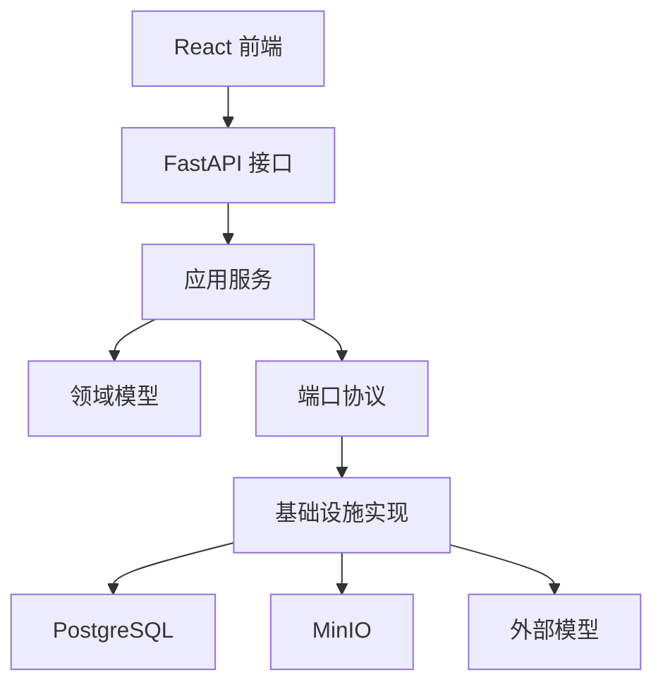

# 架构与代码地图

## 总体架构

项目采用分层结构，但它不是为了形式上的“分层”，而是为了把变化频率不同的
职责隔离：



### 为什么这样分

- `domain` 不应该知道 FastAPI、SQLAlchemy 或外部模型 SDK；
- `services` 表达业务用例，例如上传、审核、核对；
- `ports.py` 定义服务需要什么能力，而不是要求使用哪一种数据库；
- `infra` 才包含 PostgreSQL、MinIO、MinerU、OpenAI-compatible API；
- `api` 只负责认证、参数转换和 HTTP 错误映射；
- `workers` 处理跨秒、跨进程的异步状态机。

## 目录职责

| 目录 | 职责 | 阅读建议 |
|---|---|---|
| `app/domain` | Pydantic 领域对象和状态枚举 | 先读，建立业务词汇 |
| `app/services` | 用例编排与确定性业务规则 | 项目核心 |
| `app/workers` | 异步抽取状态机 | 理解任务为什么会 queued |
| `app/infra` | 数据库、对象存储、外部 API 适配 | 理解落地实现 |
| `app/api` | FastAPI 路由、权限、依赖注入 | 理解前后端契约 |
| `app/evaluation` | 模型评测、缓存和报告 | 大模型岗位重点 |
| `frontend/src` | 上传、审核、核对三个 UI 工作区 | 从用户视角理解流程 |
| `migrations` | PostgreSQL Schema 演进 | 理解数据如何随功能增长 |
| `tests` | 业务规则和边界的可执行说明 | 不确定行为时优先看 |

## 关键代码入口

### 应用启动

- `app/main.py`：注册路由；
- `run_api.py`：PyCharm 可直接运行的 API 入口；
- `run_extraction_worker.py`：独立 Worker 入口；
- `start_local_demo.ps1`：本机一键启动 API、Worker 和前端。

### 业务服务

| 文件 | 关键问题 |
|---|---|
| `document_upload_service.py` | 文件是否真实为 PDF/PNG/JPEG？如何安全保存？ |
| `extraction_service.py` | 如何创建 Run、取消 Run、查询状态？ |
| `extraction_worker.py` | 如何提交 MinerU、轮询、归一化、验证并生成 Draft？ |
| `review_service.py` | 如何修改、重分类、批准和记录审核动作？ |
| `candidate_matching_service.py` | 如何给 Receive Note 候选打分？ |
| `reconciliation_service.py` | 如何聚合一对多收货并确定差异？ |
| `reconciliation_application_service.py` | 如何保证只有批准版本能核对？ |

## 依赖方向

正确方向：

```text
API/Worker → Service → Domain/Port ← Infrastructure
```

需要特别注意：

- `Service` 可以依赖 `Protocol`；
- PostgreSQL Repository 实现这些 Protocol；
- 领域模型不导入 SQLAlchemy Model；
- 外部 API 的异常必须转为安全、稳定的业务错误码；
- UI 不应依赖数据库字段，而应依赖 API 响应契约。

## 为什么同时有 ExtractionTask 和 ExtractionRun

`ExtractionTask` 表示“这份上传文件要被处理”的长期业务对象；`ExtractionRun`
表示“一次具体处理尝试”。

例如同一份文件第一次因网络失败，用户重试后：

```text
Task T-1
  ├─ Run R-1：failed
  └─ Run R-2：ready_for_review
```

如果把二者合并，重试会覆盖历史错误、模型版本和成本，无法审计。

## 为什么有 Draft 和 Version

- `DocumentDraft` 是机器抽取结果以及验证问题的载体；
- `DocumentVersion` 是人工审核过程中产生的业务版本；
- 保存编辑会创建新 Version，而不是覆盖旧 JSON；
- 只有状态为 `approved` 的 Version 可进入核对。

这让“模型说了什么”和“人最终确认了什么”保持可追踪。

## 前端页面与后端模块

| 页面 | 前端文件 | 后端入口 |
|---|---|---|
| Upload | `frontend/src/upload/UploadPage.tsx` | `upload_routes.py`、`extraction_routes.py` |
| Review Queue | `ReviewQueuePage.tsx` | `review_routes.py` |
| Review Detail | `ReviewDocumentPage.tsx` | `ReviewService` |
| Reconcile | `ReconciliationPage.tsx` | `ReconciliationApplicationService` |

## 面试中如何描述架构

建议先讲业务责任，而不是罗列技术名：

> API 只接收请求；Worker 执行长耗时解析；MinerU 与 LLM 只生成带证据草稿；
> 人工批准后，确定性规则完成核对；PostgreSQL 保存审计状态，MinIO 保存原件。

然后再补充为什么选择：

- PostgreSQL 轮询适合单 Worker Pilot，减少消息中间件运维；
- Port/Repository 让测试可以使用 Fake 或 SQLite；
- 模型与规则分离，便于独立评测和替换模型；
- 版本不可变，避免财务结果被静默覆盖。
