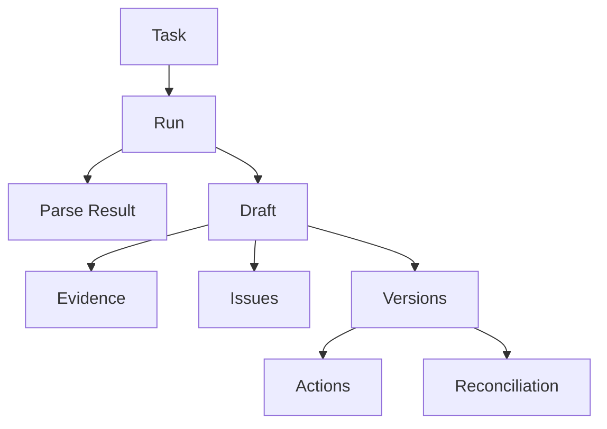

# 数据模型与基础设施

## 数据为什么要分 PostgreSQL 与 MinIO

项目同时处理两类数据：

- 适合查询、关联、事务和审计的结构化状态；
- 体积较大、主要按对象读取的二进制原件和解析产物。

因此：

| 存储 | 保存内容 |
|---|---|
| PostgreSQL | Task、Run、解析文本、Draft、Evidence、Issue、Version、Action、Session、Reconciliation |
| MinIO | 原始 PDF/图片、MinerU ZIP 产物 |

MongoDB 和 Milvus 当前都不是发票核对链路的依赖。

## 核心实体关系



### 关系解释

- 一个 Task 可以多次 Run；
- 一个成功 Run 对应一份 ParseResult 和 Draft；
- Draft 拥有多条 Evidence 和 Issue；
- 一个 Task 可以产生多个 Version；
- 每个 Version 有多条 Review Action；
- 一次 Reconciliation 引用一个 Invoice Version 和多个 Receive Note Version。

## 为什么解析 Markdown 存 PostgreSQL，ZIP 存 MinIO

Worker 归一化时频繁读取 Markdown、blocks 和 tables，它们适合按 Run 快速查询；
完整 ZIP 是审计/调试产物，体积更大且无需关系查询，因此放 MinIO。

生产环境中如果 Markdown 极大，可考虑把完整产物放对象存储，只在数据库保存
摘要和对象键。当前 Pilot 优先简化读取链路。

## MinIO 对象键

原件：

```text
<document_type>/<task_id>/original/<safe_filename>
```

MinerU 产物：

```text
<document_type>/<task_id>/runs/<run_id>/mineru/result.zip
```

Task/Run ID 使不同项目、不同上传和不同尝试不会覆盖彼此。

## 文件上传安全边界

`DocumentUploadService` 不信任浏览器上报的 MIME：

1. 限制文件大小；
2. 清理文件名并移除路径；
3. 根据 Magic Bytes 识别 PDF/PNG/JPEG；
4. 检查扩展名与真实格式一致；
5. 计算 SHA-256；
6. 先写 MinIO，再写 PostgreSQL；
7. 数据库创建失败时删除刚写入的对象。

这不是完整恶意文件扫描。生产环境仍需杀毒、内容隔离和下载响应头策略。

## PostgreSQL 为什么适合这个项目

核心数据具有明显关系：

- Version 引用 Task 和 Draft；
- Action 引用 Version 和 User；
- Reconciliation 引用多个批准版本；
- 状态领取需要条件更新；
- 审核和不可变约束需要事务。

PostgreSQL 相比 MongoDB 的主要优势不是“更高级”，而是关系、约束、事务和
条件更新更符合此业务。

## Worker 租约

`claim_next()` 不是简单读取第一条 queued 记录。Repository 必须原子地声明：

> 这个 Run 在租约过期前由当前 Worker 处理。

这样可以减少两个 Worker 同时领取同一任务的概率。当前 Pilot 没有实现完整
fencing token 和租约续期，因此不能宣称支持可靠的多 Worker 并发。

## Worker 心跳

Worker 定期向 `worker_heartbeats` 写入：

- worker_id；
- version；
- started_at；
- last_seen_at。

Runtime API 根据 `last_seen_at` 是否超过阈值判断 online/offline。它用于解释
排队状态，不是完整监控系统。

## 迁移顺序

`migrations/versions` 记录 Schema 演进：

1. extraction tasks；
2. extraction runs；
3. parse results 和租约；
4. drafts/evidence/issues；
5. users/sessions；
6. document versions/reviews；
7. reconciliation records；
8. worker heartbeats；
9. cancellation；
10. model provenance。

这组迁移本身反映了项目的设计演进：先建立文件与任务，再增加 AI 解析、
人工治理、核对和可观测性。

## 环境隔离

即使与其他项目复用同一 PostgreSQL/MinIO 服务器，也必须分离：

- PostgreSQL database：`ivida_invoice_reconciliation`；
- MinIO bucket：`ivida-invoice-documents`；
- API 端口：8200；
- 前端端口：5274。

“连接同一台服务器”不等于“共享同一份业务数据”。

## 面试复习点

- PostgreSQL 保存关系和审计状态，MinIO 保存二进制对象；
- Task/Run/Draft/Version 的外键关系表达业务生命周期；
- Magic Bytes 比浏览器 MIME 更可信；
- 租约与心跳解决不同问题：前者防重复领取，后者说明 Worker 是否活着；
- 当前单 Worker Pilot 不应包装成高可用平台。
