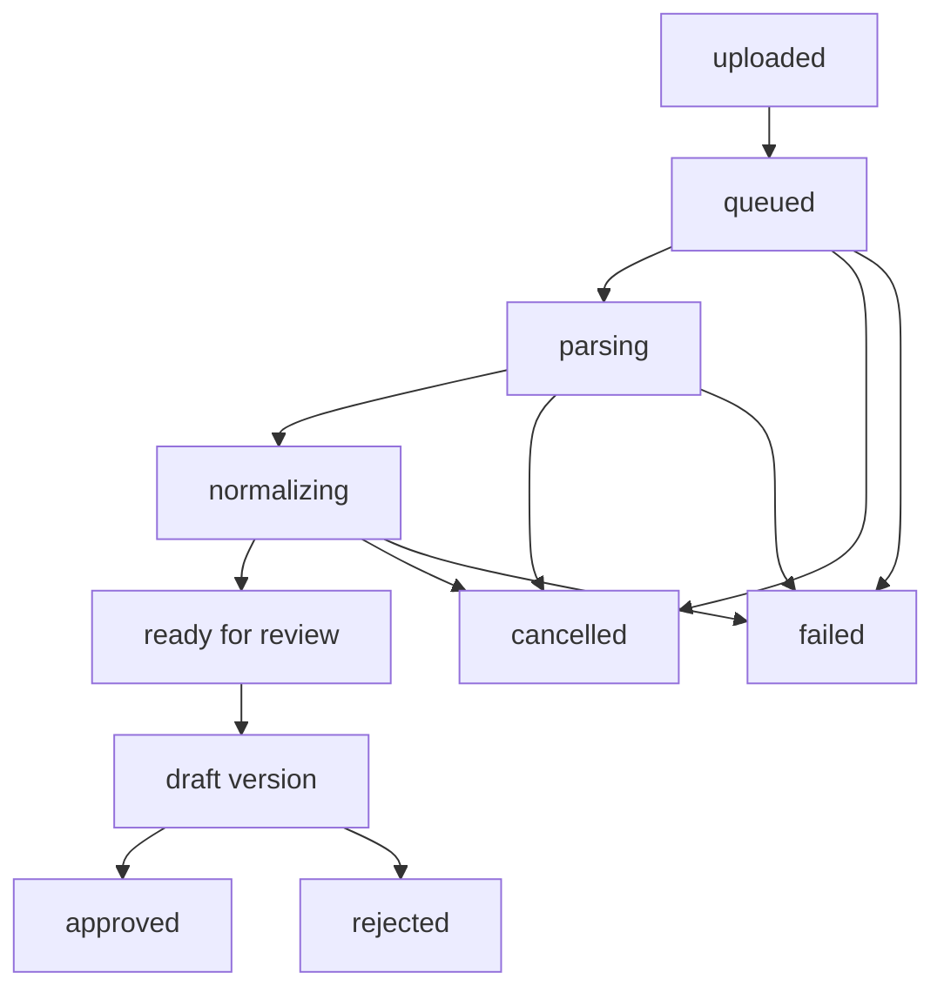

# 单据生命周期：Task、Run、Draft、Version 与 Reconciliation

## 为什么需要多个对象

第一次看数据库时，最容易产生的疑问是：

> 一张上传文件为什么需要 Task、Run、Draft、Version 这么多对象？

因为它们回答的是不同问题：

| 对象 | 回答的问题 | 是否可重试/多份 |
|---|---|---|
| ExtractionTask | 用户上传了什么文件？ | 一份原件一个 Task |
| ExtractionRun | 第几次、用什么模型处理？ | 一个 Task 可以多次 Run |
| ParseResult | MinerU 解析出了什么？ | 每次 Run 一份 |
| DocumentDraft | 模型归一化结果和校验问题是什么？ | 成功 Run 生成一份 |
| DocumentVersion | 人工最终确认或修改了什么？ | 一个 Task 可以多版本 |
| ReconciliationRecord | 哪些批准版本参与了一次核对？ | 可保存多次核对 |

## 完整状态流

注意：图中混合展示了不同对象的状态。数据库里并不存在一张万能状态表。

## ExtractionTask：文件级生命周期

定义位置：`app/domain/extraction_tasks.py`

主要状态：

- `uploaded`：原件已进入 MinIO，任务元数据已进入 PostgreSQL；
- `extracting`：至少一个 Run 正在处理；
- `ready_for_review`：机器草稿可供人工审核；
- `approved`：预留的任务级结果状态；
- `failed`：当前处理尝试失败；
- `cancelled`：处理被用户取消。

Task 保存文件名、SHA-256、对象路径、业务类型和采购订单提示。它不保存每次
模型调用的详细状态。

## ExtractionRun：尝试级状态机

定义位置：`app/domain/extraction_runs.py`

关键状态：

| 状态 | 含义 |
|---|---|
| queued | 等待 Worker 领取 |
| submitting | 正在向远端解析服务提交 |
| parsing | 等待 MinerU 完成 |
| normalizing | LLM 将解析结果映射为业务 Schema |
| validating | 规则校验阶段，当前实现主要在 normalize 内衔接 |
| ready_for_review | 已生成 Draft |
| failed | 当前尝试终止 |
| cancelled | 本地处理终止 |

Run 还保存：

- 远端 Job ID、重试次数和下次轮询时间；
- Worker 租约所有者和过期时间；
- Parser/Normalizer/Prompt 版本；
- Token、延迟和成本；
- 取消发生在哪个阶段，以及远端任务是否可能继续。

## Worker 如何推进状态

`ExtractionWorker.run_once()` 每次只领取一个可执行 Run：

1. Repository 用条件更新领取任务并写入租约；
2. 根据当前状态分派 `_submit`、`_poll` 或 `_normalize`；
3. 每个阶段完成后写入下一个状态并释放租约；
4. 外部临时错误按退避时间重新调度；
5. 不可重试错误进入 `failed`；
6. 每个外部阶段边界检查取消请求。

这种设计让 API 重启不丢任务，因为真实状态在 PostgreSQL，而不是进程内存。

## 取消为什么是协作式

本地可以停止后续处理，但 MinerU Job 已经提交后，不一定存在可靠的远端取消
接口。因此：

- queued 状态可以立即取消；
- parsing/normalizing 设置取消请求；
- Worker 在安全边界停止；
- `remote_may_continue=true` 表示远端可能仍在消耗资源；
- 取消后本地不会创建 Draft。

这比界面“隐藏任务”更诚实，因为隐藏并不等于停止。

## Draft 到 Version

成功归一化后，Worker 保存：

- `DocumentDraft.normalized_json`；
- 每个字段的 Evidence；
- Validation Issues；
- `reviewable` 或 `blocked` 验证状态。

审核人员点击进入审核时，`ReviewService.start_review()` 从 Draft 创建第一个
Version。以后每次保存编辑或修正单据类型都会创建新 Version。

## Version 到 Reconciliation

核对服务不接收 Draft，也不接收任意 JSON。应用层先通过
`get_approved_version()` 读取并验证类型：

- Invoice Version 必须为 `approved + invoice`；
- Receive Note Version 必须为 `approved + receive_note`；
- 至少选择一张 Receive Note；
- 核对结果与参与版本 ID 一起持久化。

## 常见误解

### queued 是否代表程序卡住

不一定。可能是：

- Worker 未启动；
- Worker 心跳过期；
- 前面有其他任务；
- `next_attempt_at` 尚未到；
- Run 被其他 Worker 的有效租约占用。

UI 通过 `/api/runtime/status` 区分 Worker online/offline。

### ready_for_review 是否代表模型结果正确

不是。它只代表已经生成可审核 Draft。Blocking Issue、原文证据和单据类型仍
需人工确认。

### approved 是否能被继续编辑

不能。需要从最新 Draft Version 创建新的修订路径，而不是覆盖已批准内容。
数据库 Repository 和 Service 都有不可变约束。

## 面试复习点

- Task 和 Run 分离是为了重试、审计和模型版本追踪；
- Draft 和 Version 分离是为了区分机器建议与人工确认；
- 长任务状态必须落库，不能依赖 FastAPI BackgroundTasks；
- 取消是阶段边界上的协作式取消；
- 只有 Approved Version 能进入财务核对。
