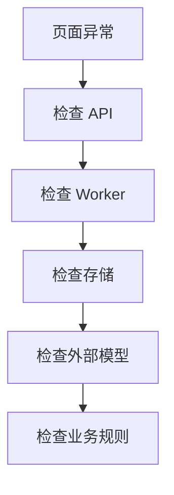

# 错误码与分层排障

## 先判断错误在哪一层



不要一看到 queued 就重启所有服务，也不要一看到模型错误就删除数据库记录。

## Worker 稳定错误码

| 错误码 | 含义 | 是否重试 | 建议检查 |
|---|---|---|---|
| TASK_NOT_FOUND | Run 对应 Task 不存在 | 否 | 数据完整性、误删 |
| REMOTE_JOB_MISSING | parsing Run 缺少 MinerU Job ID | 否 | 状态更新是否中断 |
| MINERU_TIMEOUT | MinerU 请求超时 | 是 | 网络、服务状态 |
| MINERU_RATE_LIMITED | MinerU 429 | 是 | 并发、配额 |
| MINERU_UNAVAILABLE | MinerU 5xx | 是 | 服务状态 |
| MINERU_AUTH_FAILED | Token 无效或无权限 | 否 | `.env` Token、地域 |
| MINERU_REQUEST_FAILED | 其他 MinerU 请求错误 | 否 | Worker 日志、安全消息 |
| MINERU_PARSE_FAILED | 远端明确解析失败 | 否 | 文件质量、格式 |
| NORMALIZATION_NOT_CONFIGURED | 未配置 Normalizer | 否 | API Key、Model、启动入口 |
| NORMALIZATION_REQUEST_FAILED | LLM 调用失败 | 是 | Endpoint、超时、配额 |
| PARSE_RESULT_MISSING | Run 找不到持久化解析结果 | 否 | PostgreSQL 一致性 |
| EXTRACTION_INTERNAL_ERROR | 未分类内部异常 | 否 | 服务端堆栈，不能把堆栈展示给用户 |

可重试错误由 Worker 有限指数退避，最多尝试后仍失败。手工重复点击不一定更快，
还可能增加外部 API 成本。

## Validation Rule Codes

| Rule | Severity | 含义 |
|---|---|---|
| PO_MISSING | warning | 缺少采购订单号 |
| LINE_TOTAL_MISMATCH | blocking | 行金额不等于数量乘单价 |
| GST_FREE_LINE_HAS_TAX | blocking | GST Free 行却含非零税额 |
| SUBTOTAL_MISMATCH | blocking | 小计不等于行金额之和 |
| TAX_TOTAL_MISMATCH | blocking | 税额不等于行税额之和 |
| TOTAL_MISMATCH | blocking | 总额不等于小计加税额 |
| SCHEMA_INVALID | blocking | 人工编辑 JSON 不满足目标 Schema |
| JSON_INVALID | blocking/UI | 编辑内容不是合法 JSON 对象 |

Validation Issue 是业务数据问题，不应通过重启 Worker 解决。

## Reconciliation Case 稳定错误码

Case 错误响应固定为
`{"detail":{"code":"CASE_...","message":"..."}}`。前端应依据 `code`
采取动作，不要匹配可能调整的 message 文案。

| 错误码 | HTTP | 含义 | 建议处理 |
|---|---:|---|---|
| CASE_NOT_FOUND | 404 | Case 不存在 | 刷新列表并确认 Case ID |
| CASE_ASSIGNEE_REQUIRED | 403 | 当前用户不是负责人 Reviewer | 只读查看，或联系 Admin 重新分派 |
| CASE_ADMIN_REQUIRED | 403 | 操作只允许 Admin | 切换为 Admin 或停止该操作 |
| CASE_REVISION_CONFLICT | 409 | `expected_revision` 已过期 | 重新读取详情后再决定是否重试 |
| CASE_ALREADY_CLAIMED | 409 | Case 已被其他 Reviewer 认领 | 刷新详情并转为只读 |
| CASE_REVIEWER_REQUIRED | 409 | 认领者不是 Reviewer | 使用 Reviewer 账号认领 |
| CASE_INVALID_TRANSITION | 409 | 当前状态不允许目标操作 | 刷新状态并按允许流转操作 |
| CASE_ITEMS_INCOMPLETE | 409 | 有未处理项或仍在等待材料 | 补齐所有处理结论和备注 |
| CASE_SUBMISSION_CONFLICT | 409 | 处理类型与批准/作废目标冲突 | `business_exception` 提交批准；数据/匹配错误提交作废 |
| CASE_TERMINAL | 409 | `approved` 或 `voided` 已不可变 | 如需重核，基于正确批准版本创建新 Reconciliation |
| CASE_INVALID_ASSIGNEE | 409 | 目标不是 active Reviewer | 从 Admin assignees 接口重新选择 |
| CASE_ITEM_NOT_FOUND | 409 | Item 不属于当前 Case 或已失效 | 刷新 Case 详情，不复用旧 Item ID |

Revision 冲突不是服务器故障，也不应自动覆盖新数据。客户端收到
`CASE_REVISION_CONFLICT` 后应刷新详情，让用户基于最新状态重新确认操作。

## HTTP 错误

### 401/403

- Cookie 是否存在；
- Session 是否过期；
- 用户是否 active；
- role 是否为 reviewer/admin；
- 前后端是否跨域导致 Cookie 未发送。

### 409

这是业务状态冲突，常见原因：

- Task 已在 extracting/ready_for_review，不能重复启动；
- Run 已完成，不能取消；
- Version 不是最新 Draft；
- Version 仍有 Blocking Issue；
- 核对输入不是批准版本或类型错误。
- Case revision 已过期、状态已经变化或处理类型与提交目标冲突。

先读响应 detail，不要把 409 当成服务器崩溃。

### 422

- 上传文件为空、过大或格式伪装；
- JSON/Schema 不合法；
- 驳回没有填写原因；
- Case 重新分派/退回缺少原因，或处理结论缺少备注；
- Pydantic 参数约束失败。

### 503

API 无法访问 PostgreSQL/MinIO 等依赖。检查服务连通性，不要在日志中打印密码。

## queued 排障流程

1. 打开 `/api/runtime/status`，确认 Worker online；
2. 查询 `/api/extraction-runs/{run_id}`；
3. 检查 status、next_attempt_at、attempt_count、phase_error_code；
4. parsing 时检查 remote_job_id；
5. 查看 Worker 日志中对应 run_id；
6. 确认 PostgreSQL 时间和本机时区没有导致调度误判；
7. 只有确认进程失效后才重启 Worker。

## 端口占用

检查监听者：

```powershell
Get-NetTCPConnection -LocalPort 8200 -State Listen |
  Select-Object LocalAddress, LocalPort, OwningProcess
```

再查看进程：

```powershell
Get-Process -Id <OwningProcess>
```

如果现有 API 健康，复用它；不要因为 `Errno 10048` 就强制结束未知进程。

## 数据库连接

`127.0.0.1` 指运行应用的电脑自身。数据库在远程服务器时，连接字符串必须使用
远程地址；数据库监听地址、防火墙、安全组和 PostgreSQL `pg_hba.conf` 都要
允许连接。

连接失败时区分：

- Connection refused：目标端口没有监听或被主动拒绝；
- Timeout：网络路由/安全组/防火墙；
- Authentication failed：用户、密码或认证规则；
- Database does not exist：连接到了服务器，但目标 database 未创建。

## MinIO 连接

- Access Key：身份标识；
- Secret Key：凭据；
- Secure：是否 TLS；
- Bucket 必须是本项目独立的 `ivida-invoice-documents`。

连接同一 MinIO 服务不会自动与项目2混数据，前提是 Bucket 和 Object Key 独立。

## 安全排障原则

- 日志只记录 run_id、task_id 和稳定错误码；
- 不打印 Token、密码、完整模型响应或真实财务原件；
- 对外响应使用 safe_message；
- 内部堆栈只保留在受控服务端日志；
- 不通过删除 Task/Run 来“清除报错”。
